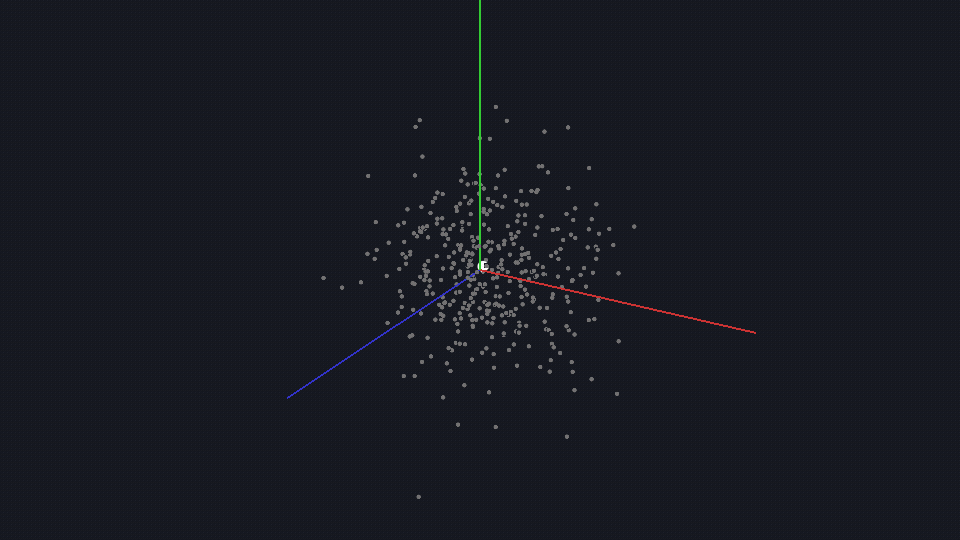

<div align="center">

# Clustering Engine

**High-performance C++ clustering with interactive visualization**

[](https://isocpp.org/)
[]()
[]()
[]()
[](LICENSE)

<p align="center">
  
</p>

```
 KMeans      MiniBatch      OnlineKMeans      DBSCAN
  0.2ms        0.1ms           0.1ms           2ms
vs sklearn:  1,155ms         22ms             —            —
             5,777x          223x             —            —
```

</div>

---

## What is this?

A C++ clustering library that **crushes scikit-learn on speed** while providing an interactive desktop GUI for exploring your data. Load a CSV, pick columns, run clustering, see results in 3D — all in one app.

**Key differentiator:** Scikit-learn freezes on multi-core systems due to Python GIL. This engine uses true C++ parallelism with AVX2 SIMD instructions.

---

## Performance

### KMeans vs scikit-learn

| Dataset | Clustering Engine | scikit-learn | Speedup |
|:--------|:-----------------|:-------------|:--------|
| Iris (150×4, k=3) | **0.2ms** | 1,155ms | **5,777×** |
| Wine (178×13, k=3) | **0.2ms** | 35.8ms | **179×** |
| Synthetic (10k×32, k=10) | **29.6ms** | 798.8ms | **27×** |

### MiniBatch KMeans

| Dataset | Clustering Engine | scikit-learn | Speedup |
|:--------|:-----------------|:-------------|:--------|
| Iris (150×4, k=3) | **0.1ms** | 22.3ms | **223×** |
| Synthetic (10k×32, k=10) | **15.0ms** | 209.3ms | **14×** |

### PCA (Eigen + BLAS)

| Transformation | Clustering Engine | scikit-learn | Variance |
|:---------------|:-----------------|:-------------|:---------|
| 32d → 2d | 25.9ms | 17.5ms | 37.7% |
| 32d → 5d | 34.7ms | 14.1ms | 75.9% |
| 32d → 10d | **7.6ms** | 7.9ms | 99.2% |

### OnlineKMeans (no sklearn equivalent)

| Metric | Value |
|:-------|:------|
| Throughput | 6.6× faster than batch KMeans |
| Streaming | Sliding window + forgetting factor |
| Drift | Auto-detection + retrain |

---

## Features

### Algorithms

| Algorithm | Use Case | Key Feature |
|:----------|:---------|:------------|
| **KMeans** | Standard clustering | KMeans++ init, AVX2 SIMD |
| **MiniBatchKMeans** | Large datasets | Random batch sampling |
| **OnlineKMeans** | Streaming data | Sliding window, auto-retrain |
| **DBSCAN** | Arbitrary shapes | Density-based, auto noise detection |
| **PCA** | Linear reduction | Eigen3 + OpenBLAS |
| **t-SNE** | Visualization | Gradient descent embedding |

### Interactive GUI

- CSV import with auto-detection of headers and data types
- Data table with sorting, NaN highlighting, virtual scrolling
- Column management: rename, remove, select for clustering
- 5 preprocessing operations: normalize, standardize, minmax, log, clip
- 8 missing data strategies: drop, impute, interpolate
- 4 clustering algorithms with real-time 3D visualization
- Elbow / silhouette / Davies-Bouldin evaluation sweep
- Auto best-k detection
- PNG and CSV export
- Undo/redo pipeline

### Compute

- **AVX2 SIMD** — 8 floats per instruction
- **FMA** — Fused multiply-add (when available)
- **ThreadPool** — Auto-detect cores, capped at 8
- **Eigen3 + OpenBLAS** — PCA acceleration

---

## Quick Start

### Install Dependencies

```bash
# Ubuntu/Debian
sudo apt install cmake libglfw3-dev libglew-dev libeigen3-dev \
    libgtest-dev pybind11-dev libopenblas-dev

# macOS
brew install cmake glfw glew eigen gtest pybind11 openblas

# Windows (vcpkg)
vcpkg install glfw3 glew eigen3 gtest pybind11 openblas
```

### Build

```bash
git clone https://github.com/gen-computing/clustering.git
cd clustering
mkdir build && cd build

# Linux/macOS
cmake .. -DCMAKE_BUILD_TYPE=Release
make -j$(nproc)

# Windows (MSVC + vcpkg)
cmake .. -DCMAKE_BUILD_TYPE=Release -DCMAKE_TOOLCHAIN_FILE=%VCPKG_ROOT%/scripts/buildsystems/vcpkg.cmake
cmake --build . --config Release
```

### Run

```bash
./tests              # 79 tests
./imgui_bench        # Interactive GUI
./basic              # Console demo
./basic --viz        # With OpenGL visualization
./benchmark          # Performance comparison
```

### Python

```bash
cmake .. -DBUILD_PYTHON=ON -DCMAKE_BUILD_TYPE=Release
make -j$(nproc)
cp _clustering*.so ../python/clustering/
```

```python
from clustering import KMeans, PCA, OnlineKMeans
import numpy as np

X = np.random.randn(10000, 50).astype(np.float32)

km = KMeans(k=5)
km.fit(X)
labels, centroids = km.labels, km.centroids

pca = PCA(n_components=2)
Y = pca.fit_transform(X)
```

---

## GUI Layout

```
┌─ Menu Bar (File | Edit | Help) ──────────────────────────────────────┐
├────────────────┬─────────────────────────────────────────────────────┤
│  IMPORT        │                                                     │
│  [Open CSV]    │   DATA TABLE                                        │
│  Header: ☑     │   Virtual scrolling, sortable, NaN highlight        │
│                │                                                     │
│  COLUMN STATS  ├─────────────────────────────────────────────────────┤
│  Mean/Median   │                                                     │
│  Histogram     │   3D VIEWPORT (OpenGL)                              │
│                │   Mouse drag=rotate | Scroll=zoom | R=reset         │
│  PREPROCESS    │                                                     │
│  Normalize     │                                                     │
│  Standardize   │                                                     │
│  MinMax/Log    │                                                     │
│  Clip          │                                                     │
│  Missing (8)   │                                                     │
│  Undo/Redo     │                                                     │
├────────────────┴─────────────────────────────────────────────────────┤
│ Status: KMeans | k=5 | Inertia: 79.8 | Iter: 4 | Sil: 0.55         │
└─────────────────────────────────────────────────────────────────────┘
```

### Cluster & Evaluate Tab

```
┌────────────────┬─────────────────────────────────────────────────────┐
│  FIND OPTIMAL k│                                                     │
│  k Min: [2]    │   3D VIEWPORT (clustered data)                     │
│  k Max: [15]   │   Colored by cluster | Centroids as white dots     │
│  [Run Sweep]   │   Text overlay: points, clusters, inertia          │
│  ── elbow plot │                                                     │
│  ── sil plot   │                                                     │
│  ── DB plot    │                                                     │
│                │                                                     │
│  CLUSTERING    │                                                     │
│  Select Cols ☑ │                                                     │
│  Algorithm ▼   │                                                     │
│  k: [5]        │                                                     │
│  [Run Cluster] │                                                     │
│  [Reset All]   │                                                     │
├────────────────┴─────────────────────────────────────────────────────┤
│ KMeans | k=5 | Inertia: 79.8 | Iter: 4 | Sil: 0.55 | DB: 1.23      │
└─────────────────────────────────────────────────────────────────────┘
```

---

## API Reference

### KMeans

```cpp
#include <clustering/clustering.h>
using namespace clustering;

// Simple
KMeans km(5);
km.fit(X);
Vector labels = km.labels();
Matrix centroids = km.centroids();
Vector preds = km.predict(new_X);

// With config
KMeansConfig cfg;
cfg.k = 10;
cfg.max_iter = 300;
cfg.max_threads = 0;  // auto-detect
KMeans km(cfg);
```

| Method | Returns | Description |
|:-------|:--------|:------------|
| `fit(X)` | void | Train on data matrix |
| `predict(X)` | Vector | Assign new data to clusters |
| `partial_fit(X)` | void | Incremental update |
| `labels()` | const Vector& | Cluster assignments |
| `centroids()` | const Matrix& | Cluster centers |
| `n_iter()` | size_t | Iterations run |
| `inertia()` | float | Sum of squared distances |

### OnlineKMeans

```cpp
OnlineConfig cfg;
cfg.k = 5;
cfg.window_size = 1000;
cfg.forgetting_factor = 0.99;
cfg.auto_retrain = true;

OnlineKMeans km(cfg);
km.partial_fit(batch1);
km.partial_fit(batch2);
size_t seen = km.points_seen();
```

### PCA

```cpp
PCA pca(2);
Matrix Y = pca.fit_transform(X);
float var = pca.total_explained_variance_ratio();
Matrix X_recon = pca.inverse_transform(Y);
```

### DBSCAN

```cpp
DBSCAN db(0.5f, 5);  // epsilon, minPts
db.fit(X);
Vector labels = db.labels();
size_t n_clusters = db.n_clusters();
size_t n_noise = db.n_noise();
float eps = DBSCAN::estimate_epsilon(X);
```

### Drift Detection

```cpp
DriftDetector det;
det.set_threshold(0.1f);
DriftMetrics m = det.check(X, labels, centroids);
if (m.drift_detected) km.fit(X);
```

### Distance Functions

```cpp
#include <clustering/distance.h>

float d = l2_distance_avx2(a, b, dim);
Matrix dist = compute_distance_matrix(X, Y, threads);
size_t nearest = nearest_centroid(point, centroids);
```

---

## Constraints & Limitations

### Algorithm Limits

| Limitation | Details |
|:-----------|:--------|
| **KMeans** | Requires k specified upfront. Spherical clusters only. Sensitive to outliers. |
| **MiniBatchKMeans** | Approximate results. Quality depends on batch_size. |
| **OnlineKMeans** | No inverse transform. Single-pass only. |
| **DBSCAN** | O(n²) distance computation. Struggles with varying density. No predict() for new points without re-fitting. |
| **PCA** | Linear only. Jacobi eigendecomposition O(n³) — slower than sklearn's randomized SVD for small k. |
| **t-SNE** | O(n²) memory. No transform() for new points. Visualization only. |

### Data Limits

| Constraint | Value |
|:-----------|:------|
| Max features | Practical limit ~10,000 (memory) |
| Max samples | Limited by RAM (float32, row-major) |
| Thread cap | 8 threads maximum |
| PCA dimensions | n_components ≤ min(n_samples, n_features) |
| t-SNE samples | < 10,000 without Barnes-Hut approximation |
| CSV loading | Synchronous (blocks GUI during load) |
| NaN handling | Columns with >90% NaN auto-dropped |

### Platform

| Requirement | Version |
|:------------|:--------|
| C++ compiler | GCC 10+ / Clang 12+ / MSVC 2019+ (C++20) |
| CMake | 3.16+ |
| OS | Linux, macOS, Windows (OpenGL 3.3+) |
| CPU | AVX2 support (Intel Haswell 2013+, AMD Excavator+, MSVC `/arch:AVX2`) |
| Windows deps | vcpkg: `glfw3 glew eigen3 gtest pybind11 openblas` |

### GUI

| Constraint | Details |
|:-----------|:--------|
| Single window | Only one renderer instance at a time |
| OpenGL 3.3 | Required for rendering |
| No headless | GUI requires display server |
| CSV dialog | Uses native file dialog (tinyfiledialogs) |
| FBO resize | RBO leaks on rapid resize (known issue) |

---

## Project Structure

```
clustering/
├── include/clustering/     # 16 public headers
│   ├── clustering.h        # Umbrella include
│   ├── kmeans.h            # KMeans algorithm
│   ├── online.h            # OnlineKMeans (streaming)
│   ├── mini_batch.h        # MiniBatchKMeans
│   ├── dbscan.h            # DBSCAN density clustering
│   ├── pca.h               # PCA reduction
│   ├── tsne.h              # t-SNE embedding
│   ├── distance.h          # AVX2 distance functions
│   ├── thread_pool.h       # Global thread pool
│   ├── drift.h             # Concept drift detection
│   ├── evaluation.h        # Elbow/silhouette/DB scores
│   ├── versioning.h        # Centroid save/load
│   ├── feature_store.h     # Preprocessing cache
│   ├── renderer.h          # OpenGL 3D renderer
│   ├── matrix.h            # Matrix/Vector classes
│   └── logging.h           # Debug/release logging
├── src/
│   ├── core/               # KMeans, Online, MiniBatch, DBSCAN
│   ├── dimensionality/     # PCA, t-SNE
│   ├── operational/        # Drift, Evaluation, Versioning, FeatureStore
│   ├── compute/            # AVX2 Distance, ThreadPool
│   ├── visualization/      # OpenGL Renderer, Shaders, Text
│   ├── gui/                # DataTable, ColumnStats, CSVImporter, Pipeline
│   └── app/                # ImGui desktop application
├── extern/                 # Dear ImGui, tinyfiledialogs
├── tests/                  # 79 GTest tests
├── examples/               # Demo executables
├── benchmarks/             # C++ and Python benchmarks
├── data/                   # Sample datasets (iris, wine, synthetic)
├── python/                 # pybind11 bindings
└── CMakeLists.txt
```

---

## Testing

```bash
cd build && ./tests
```

```
[==========] 79 tests from 19 test suites ran.
[  PASSED  ] 79 tests.
```

### Coverage

| Module | Tests | Status |
|:-------|:------|:-------|
| KMeans | 5 | All pass |
| Threading | 7 | All pass |
| Operations | 5 | All pass |
| Comprehensive | 34 | All pass |
| Matrix | 5 | All pass |
| DBSCAN | 7 | All pass |
| Evaluation | 5 | All pass |
| **Total** | **79** | **All pass** |

---

## Benchmarks

### Reproduce

```bash
./benchmark                    # C++ benchmarks
python3 benchmarks/sklearn_benchmark.py  # vs sklearn
```

### System

- CPU: Intel i7 13th Gen (8 cores / 16 threads)
- RAM: 32GB DDR5
- Compiler: GCC `-O3 -mavx2 -mfma`
- Python: 3.12 with scikit-learn 1.9.0

---

## Contributing

1. Fork the repository
2. Create a feature branch
3. Make your changes
4. Add tests if applicable
5. Run `./tests` to verify
6. Submit a pull request

### Code Style

- C++20 features welcome
- Follow existing naming conventions (snake_case)
- Comment public APIs
- No external dependencies beyond listed ones

---

## License

MIT License. See [LICENSE](LICENSE) for details.
