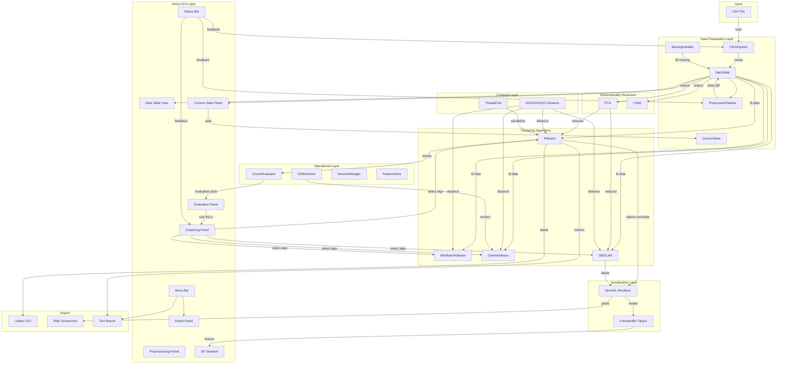
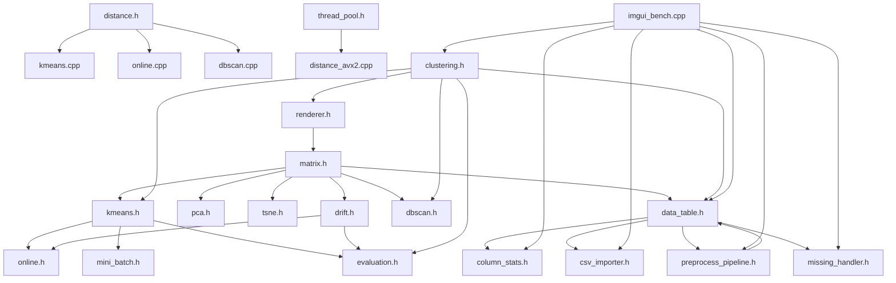
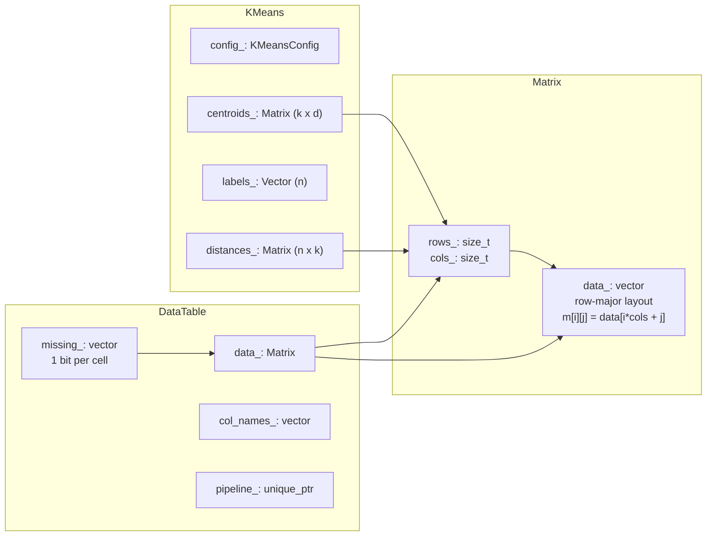
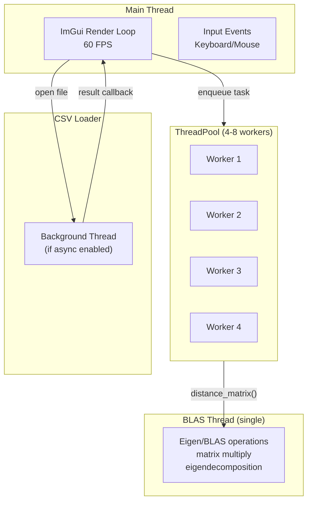

# Clustering Engine - System Architecture

## Data Flow

```mermaid
flowchart TB
    subgraph Input
        CSV[CSV File]
    end

    subgraph GUI["ImGui GUI Layer"]
        Menu[Menu Bar]
        Import[Import Panel]
        Table[Data Table View]
        Stats[Column Stats Panel]
        Preproc[Preprocessing Panel]
        Cluster[Clustering Panel]
        Eval[Evaluation Panel]
        Viewport[3D Viewport]
        Status[Status Bar]
    end

    subgraph DataPrep["Data Preparation Layer"]
        DT[DataTable]
        CS[ColumnStats]
        CI[CSVImporter]
        PP[PreprocessPipeline]
        MH[MissingHandler]
    end

    subgraph Algorithms["Clustering Algorithms"]
        KM[KMeans]
        MB[MiniBatchKMeans]
        OL[OnlineKMeans]
        DB[DBSCAN]
    end

    subgraph DimRed["Dimensionality Reduction"]
        PCA[PCA]
        TSNE[t-SNE]
    end

    subgraph Ops["Operational Layer"]
        DR[DriftDetector]
        EV[ClusterEvaluator]
        VM[VersionManager]
        FS[FeatureStore]
    end

    subgraph Compute["Compute Layer"]
        AVX[AVX2/AVX512 Distance]
        TP[ThreadPool]
    end

    subgraph Viz["Visualization Layer"]
        GL[OpenGL Renderer]
        FBO[Framebuffer Object]
    end

    subgraph Export["Export"]
        CSV_E[Labels CSV]
        PNG[PNG Screenshot]
        RPT[Text Report]
    end

    CSV -->|load| CI
    CI -->|create| DT
    DT --> Table
    DT --> Stats
    DT --> PP
    PP -->|store diff| DT
    MH -->|fill missing| DT
    Stats -->|read| CS

    Cluster -->|select algo| KM
    Cluster -->|select algo| MB
    Cluster -->|select algo| OL
    Cluster -->|select algo| DB
    DT -->|fit data| KM
    DT -->|fit data| MB
    DT -->|fit data| OL
    DT -->|fit data| DB

    DT -->|reduce| PCA
    DT -->|reduce| TSNE
    PCA -->|reduced| KM
    PCA -->|reduced| DB

    KM -->|labels+centroids| GL
    DB -->|labels| GL
    GL -->|render| FBO
    FBO -->|texture| Viewport

    KM -->|results| EV
    EV -->|evaluation plots| Eval

    KM -->|labels| CSV_E
    GL -->|pixels| PNG
    KM -->|metrics| RPT

    AVX -->|distance| KM
    AVX -->|distance| MB
    AVX -->|distance| OL
    AVX -->|distance| DB
    TP -->|parallelize| KM
    DR -->|monitor| OL

    Menu --> Import
    Menu --> RPT
    Eval -->|"Use this k"| Cluster
    Status -->|feedback| PP
    Status -->|feedback| Cluster
    Status -->|feedback| CI
```

## Module Dependency Graph

```mermaid
graph TD
    matrix.h --> kmeans.h
    matrix.h --> pca.h
    matrix.h --> tsne.h
    matrix.h --> drift.h
    matrix.h --> dbscan.h
    kmeans.h --> online.h
    kmeans.h --> mini_batch.h
    drift.h --> online.h
    kmeans.h --> evaluation.h
    drift.h --> evaluation.h
    distance.h --> kmeans.cpp
    distance.h --> online.cpp
    distance.h --> dbscan.cpp
    thread_pool.h --> distance_avx2.cpp
    matrix.h --> data_table.h
    data_table.h --> column_stats.h
    data_table.h --> csv_importer.h
    data_table.h --> preprocess_pipeline.h
    data_table.h --> missing_handler.h
    preprocess_pipeline.h --> data_table.h
    renderer.h --> matrix.h
    clustering.h --> kmeans.h
    clustering.h --> dbscan.h
    clustering.h --> evaluation.h
    clustering.h --> renderer.h
    clustering.h --> data_table.h

    imgui_bench.cpp --> clustering.h
    imgui_bench.cpp --> data_table.h
    imgui_bench.cpp --> column_stats.h
    imgui_bench.cpp --> csv_importer.h
    imgui_bench.cpp --> preprocess_pipeline.h
    imgui_bench.cpp --> missing_handler.h
```

## Memory Layout

```mermaid
flowchart LR
    subgraph Matrix
        direction TB
        M_meta["rows_: size_t\ncols_: size_t"]
        M_data["data_: vector<float>\nrow-major layout\nm[i][j] = data[i*cols + j]"]
    end

    subgraph DataTable
        direction TB
        DT_mat["data_: Matrix"]
        DT_names["col_names_: vector<string>"]
        DT_mask["missing_: vector<uint8_t>\n1 bit per cell"]
        DT_pl["pipeline_: unique_ptr<PreprocessPipeline>"]
    end

    subgraph KMeans
        direction TB
        KM_cfg["config_: KMeansConfig"]
        KM_ctr["centroids_: Matrix (k x d)"]
        KM_lbl["labels_: Vector (n)"]
        KM_dst["distances_: Matrix (n x k)"]
    end

    M_meta --> M_data
    DT_mat --> M_meta
    DT_mat --> M_data
    DT_mask --> DT_mat
    KM_ctr --> M_meta
    KM_dst --> M_meta
```

## Threading Architecture

```mermaid
flowchart TB
    subgraph Main["Main Thread"]
        GUI_Loop["ImGui Render Loop\n60 FPS"]
        Event_Handler["Input Events\nKeyboard/Mouse"]
    end

    subgraph WorkerPool["ThreadPool (4-8 workers)"]
        W1[Worker 1]
        W2[Worker 2]
        W3[Worker 3]
        W4[Worker 4]
    end

    subgraph BLAS["BLAS Thread (single)"]
        linear_algebra["Eigen/BLAS operations\nmatrix multiply\neigendecomposition"]
    end

    subgraph CSV["CSV Loader"]
        csv_thread["Background Thread\n(if async enabled)"]
    end

    GUI_Loop -->|"enqueue task"| WorkerPool
    WorkerPool -->|"distance_matrix()"| linear_algebra
    GUI_Loop -->|"open file"| csv_thread
    csv_thread -->|"result callback"| GUI_Loop
```
