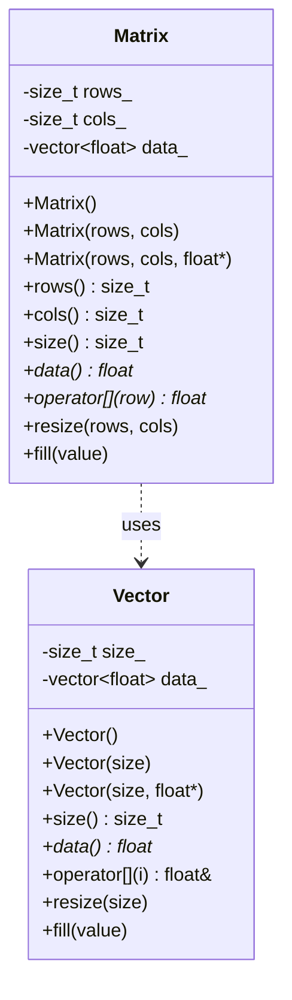
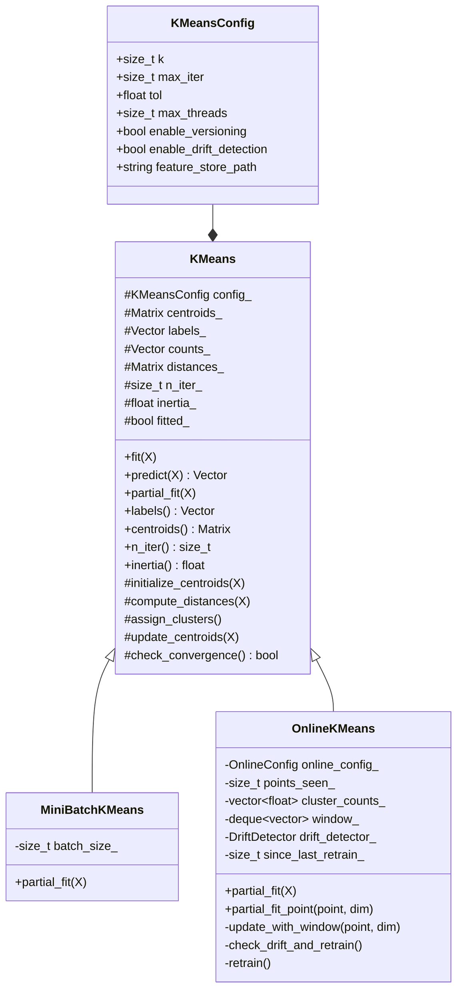
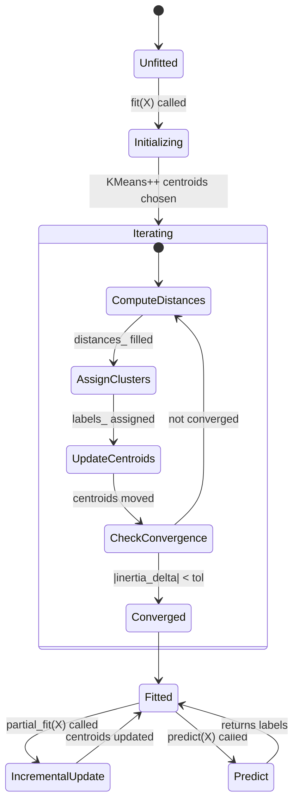
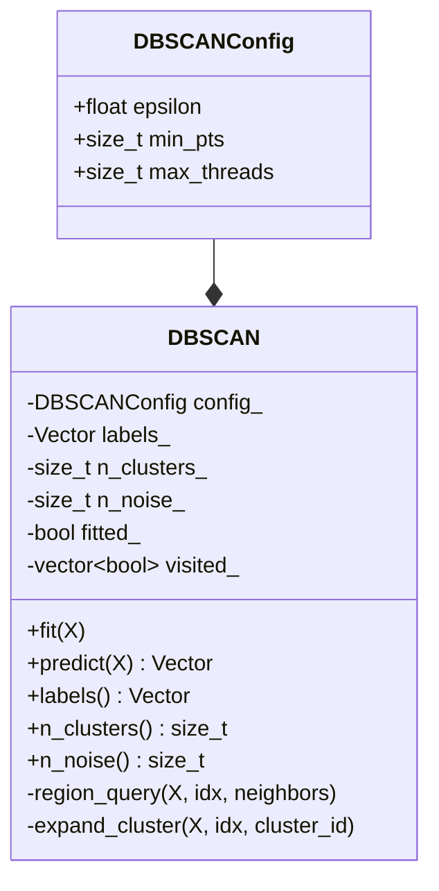
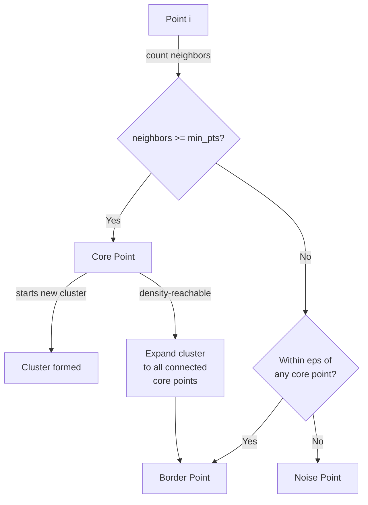
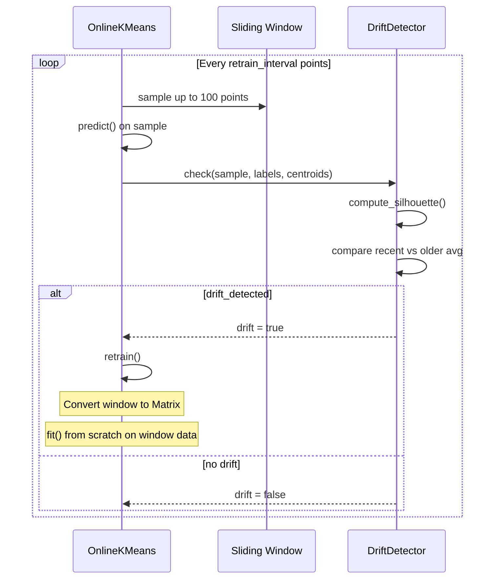
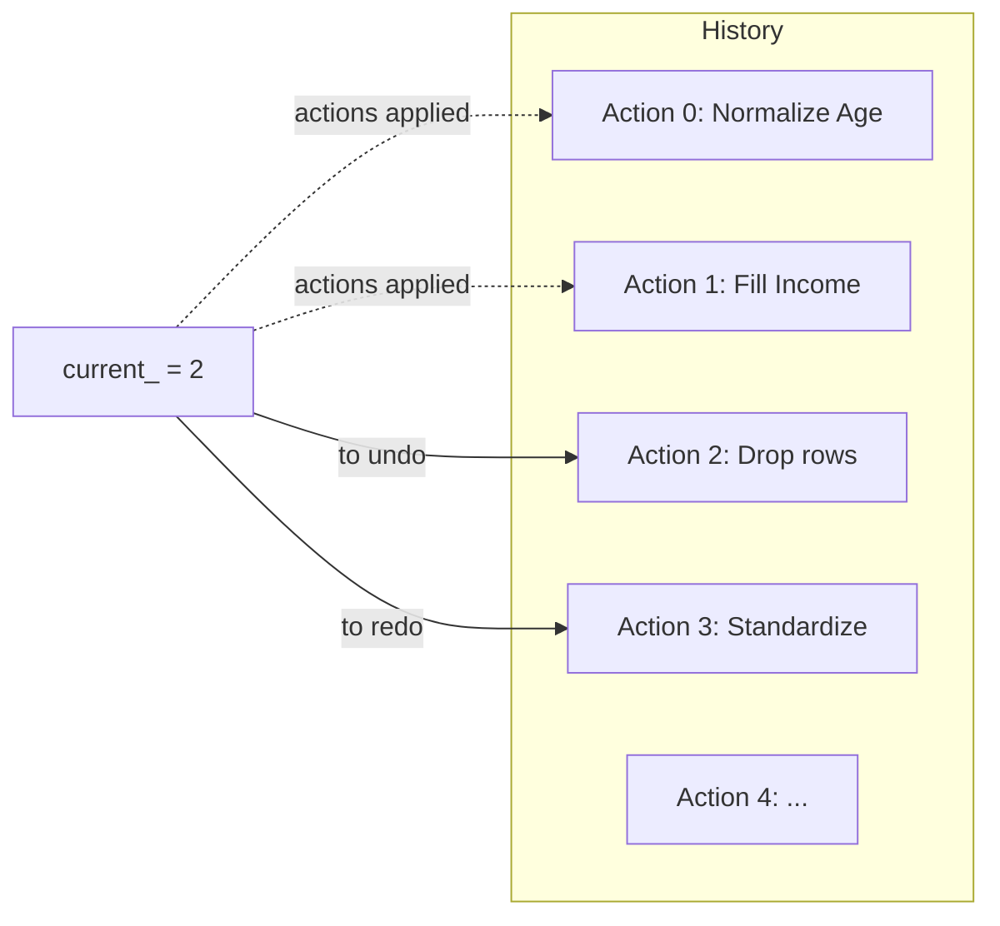
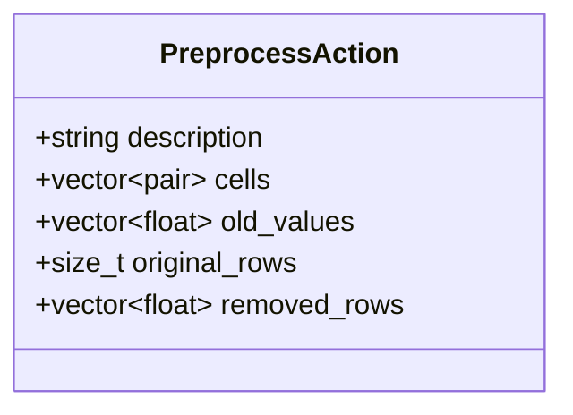

# Clustering Engine - Module Implementations

## Module 1: Matrix (Data Foundation)

**Files**: `include/clustering/matrix.h`

### Class Diagram



### Storage Layout

```
Row-major order: element at (row i, column j) stored at index i * cols_ + j

Example: 3 rows x 4 columns
  data_[0]  = row 0, col 0
  data_[1]  = row 0, col 1
  data_[2]  = row 0, col 2
  data_[3]  = row 0, col 3
  data_[4]  = row 1, col 0
  ...
  data_[11] = row 2, col 3
```

### Key Design Decisions
- Uses `std::vector<float>` internally (contiguous memory, cache-friendly)
- Row-major matches numpy's default layout (zero-copy interop via pybind11)
- `operator[]` returns pointer to row start, enabling `m[i][j]` syntax
- No bounds checking (performance over safety, same as C arrays)

---

## Module 2: KMeans (Batch Clustering)

**Files**: `include/clustering/kmeans.h`, `src/core/kmeans.cpp`

### Class Hierarchy



### Algorithm State Machine



### KMeans++ Initialization Detail

```
1. Pick first centroid randomly from X
2. For c = 2 to k:
   a. For each point i, compute min distance to any existing centroid
   b. Compute total = sum(d_i^2)
   c. Generate r ~ Uniform(0, total)
   d. Walk through points, accumulate d_i^2 until >= r
   e. That point becomes centroid c
```

---

## Module 3: DBSCAN (Density Clustering)

**Files**: `include/clustering/dbscan.h`, `src/core/dbscan.cpp`

### Class Diagram



### Point Classification



### Algorithm Walkthrough

```
Input: X (n x d), epsilon, min_pts
Output: labels[] (0=noise, 1..k=cluster)

1. All points start as UNCLASSIFIED (-1)
2. For each point i:
   a. If visited[i], skip
   b. visited[i] = true
   c. neighbors = all points j where distance(i,j) <= epsilon
   d. If |neighbors| < min_pts:
      - labels[i] = NOISE (-2)
   e. Else:
      - Start new cluster: cluster_id++
      - labels[i] = cluster_id
      - For each neighbor n in neighbors:
        - If n not visited: mark visited, get n's neighbors
          If |n's neighbors| >= min_pts: add them to expansion queue
        - If n unclassified or noise: labels[n] = cluster_id
3. Relabel: NOISE (-2) -> 0, clusters start at 1
```

---

## Module 4: OnlineKMeans (Streaming)

**Files**: `include/clustering/online.h`, `src/core/online.cpp`

### Sliding Window + Forgetting Factor

```mermaid
flowchart LR
    subgraph Window[Sliding Window deque]
        direction LR
        P1[Point 1: oldest] --> P2[Point 2] --> P3[...] --> PN[Point N: newest]
    end

    NewPoint[New Point] -->|push_back| PN
    NewPoint -->|if size > window_size| Pop[pop_front oldest]

    NewPoint -->|compute| Nearest[Find nearest centroid]
    Nearest -->|apply| Decay[count *= forgetting_factor]
    Decay -->|add| Count[count += 1.0]
    Count -->|lr = 1/count| Move[centroid += lr * (point - centroid)]
```

### Drift Detection + Auto-Retrain



---

## Module 5: PCA (Dimensionality Reduction)

**Files**: `include/clustering/pca.h`, `src/dimensionality/pca.cpp`

### Computation Flow

```mermaid
flowchart TD
    X[Input X: n x d] -->|Step 1| Center[Center Data\nXc = X - mean]
    Center -->|Step 2| Cov[Covariance Matrix\ncov = Xc^T * Xc / (n-1)\nd x d symmetric]
    Cov -->|Step 3| Eig[Eigendecomposition\nEigen::SelfAdjointEigenSolver\nO(d^3) with LAPACK DSYEVD]
    Eig -->|Step 4| Sort[Sort eigenvalues descending\nkeep top k eigenvectors\n= components_ matrix (k x d)]
    Sort -->|Step 5| Project[Project: Y = Xc * components^T\nn x k matrix, BLAS-accelerated]
    Project -->|Step 6| Inverse[Inverse: X_approx = Y * components + mean\nn x d, approximate reconstruction]
```

### Eigenvalue Interpretation

```
explained_variance_[i] = eigenvalue of component i
explained_variance_ratio_[i] = eigenvalue[i] / sum(all eigenvalues)
total_explained_variance_ratio = sum of ratio for top k

Example: k=2, original d=10
  ratio = [0.42, 0.23, 0.10, 0.08, ...]
  total = 0.65 = "65% of original information retained"
```

---

## Module 6: DriftDetector (Quality Monitoring)

**Files**: `include/clustering/drift.h`, `src/operational/drift.cpp`

### Metrics Computation Flow

```mermaid
flowchart TD
    Input[(X, labels, centroids)] --> Sil[Silhouette Score\nO(n^2 * d)]
    Input --> DB[Davies-Bouldin Index\nO(n*k*d + k^2*d)]
    Input --> CH[Calinski-Harabasz Score\nO(n*d + k*d)]
    Input --> Stab[Cluster Stability\nO(n + k)]

    Sil -->|"s(i) = (b(i)-a(i))/max(a,b)"| SilScore[silhouette_score: -1 to 1]
    DB -->|"avg(max(R_ij))"| DBScore[davies_bouldin: 0 to inf]
    CH -->|"(between/(k-1))/(within/(n-k))"| CHScore[calinski_harabasz: 0 to inf]
    Stab -->|"entropy/max_entropy"| StabScore[cluster_stability: 0 to 1]

    SilScore --> History[History Window\ndeque<DriftMetrics>]
    DBScore --> History
    CHScore --> History
    StabScore --> History

    History -->|split older/recent| Trend[Compare silhouette trends]
    Trend -->|degradation > threshold| Drift[drift_detected = true]

    SilScore -.->|highest| Good[Good clustering: score >> 0]
    DBScore -.->|lowest| Good
    CHScore -.->|highest| Good
    StabScore -.->|near 1.0| Good
```

### History-Based Drift Detection

```
1. Maintain window_size history entries (default 10)
2. On each check(), push new DriftMetrics
3. If history.size() >= 3:
   - Split into older half [0..mid) and recent half [mid..size)
   - recent_avg = average silhouette of recent half
   - older_avg = average silhouette of older half
   - drift_detected = (older_avg - recent_avg) > threshold
4. This catches gradual degradation (concept drift)
```

---

## Module 7: DataTable + Preprocessing Pipeline

**Files**: `src/gui/data_table.h/.cpp`, `src/gui/preprocess_pipeline.h/.cpp`

### Undo/Redo Mechanism



### Action Storage



- **Undo**: Walk cells[], restore old_values[] to data_[row][col]
- **Redo**: Re-apply the forward effect (sets cells to NaN for fill ops)
- **Undo All**: `while(can_undo()) undo()` -- reverts to original data
- **Drop rows undo**: stored removed_rows appended back, original_rows restored

---

## Module 8: ClusterEvaluator

**Files**: `include/clustering/evaluation.h`, `src/operational/evaluation.cpp`

### Evaluation Methods

```mermaid
flowchart TD
    X[Input X] --> Loop[For k = min_k to max_k]
    Loop --> Fit[KMeans(k).fit(X)]
    Fit --> Metrics[DriftDetector.check(X, labels, centroids)]
    Metrics --> Store[EvalResult{k, inertia, silhouette, DB, CH}]

    Store --> Elbow[Elbow Method\nFind max curvature of inertia curve\nbest_k_elbow()]
    Store --> Sil[Silhouette Analysis\nFind peak silhouette score\nbest_k_silhouette()]
    Store --> DB[DB Analysis\nFind minimum DB index\nbest_k_db()]

    Elbow --> Report["Best k (elbow)"]
    Sil --> Report
    DB --> Report
```

### Elbow Method Algorithm

```
Input: vector<EvalResult> with inertia per k
Output: k with maximum curvature

curvature(k) = inertia[k-1] + inertia[k+1] - 2*inertia[k]
Higher curvature = sharper bend = better elbow point

Example:
  k=2: inertia=5000
  k=3: inertia=2000  <- big drop (curvature high)
  k=4: inertia=1800
  k=5: inertia=1700  <- diminishing returns (curvature low)
  → elbow at k=3 (maximum curvature point)
```

---

## Module 9: OpenGL Renderer (Split into 4 files)

**Files**: `include/clustering/renderer.h`, `src/visualization/renderer.cpp`, `src/visualization/mat4.cpp`, `src/visualization/shaders.cpp`, `src/visualization/text.cpp`

### File Responsibilities

| File | Lines | Responsibility |
|------|-------|---------------|
| `renderer.h` | ~150 | Public API: RendererConfig, Renderer class, camera controls, FBO support |
| `renderer.cpp` | ~940 | Main class: init, shutdown, set_data, run, render_frame, render_to_fbo, GLFW callbacks, RendererImpl global state |
| `mat4.h/.cpp` | ~80 | 4x4 matrix math: identity, perspective, ortho, lookAt, multiply |
| `shaders.h/.cpp` | ~140 | GLSL shader source strings + compile_shader() / create_program() utilities |
| `text.h/.cpp` | ~160 | Color palette, build_text_quads(), get_char_bitmap() font rendering |

### Rendering Pipeline

```mermaid
flowchart LR
    subgraph CPU[CPU Side]
        Points[Point Positions\n+ Colors] --> VBO[Vertex Buffer\nglBufferData]
        Camera[Camera State\nrot_x/rot_y/zoom] --> MVP[MVP Matrix\nperspective * lookAt]
    end

    subgraph GPU[GPU Side]
        VBO --> VertShader[Vertex Shader\nposition * MVP\ngl_PointSize = uSize]
        MVP --> VertShader
        VertShader --> FragShader[Fragment Shader\nsoft circle via\nsmoothstep(0.38, 0.5, r)]
    end

    subgraph Output
        FragShader --> FBO[Framebuffer Object\ncolor attachment = texture]
        FBO --> ImGui[ImGui::Image\nembedded in viewport panel]
    end
```

### Camera Model

```
Orbital/spherical camera around bounding box center (cx, cy, cz):

  dist = max_range * 3.0 / zoom

  ex = cx + dist * sin(rot_y) * cos(rot_x)
  ey = cy + dist * sin(rot_x)
  ez = cz + dist * cos(rot_y) * cos(rot_x)

  view = lookAt(ex, ey, ez, cx, cy, cz, 0, 1, 0)
  projection = perspective(45°, aspect, near, far)
  mvp = projection * view

Controls:
  Left-drag: rot_y += dx*0.008, rot_x += dy*0.008
  Scroll:    zoom *= 1.0 + wheel*0.1
  R key:     rot_x=0.4, rot_y=0.5, zoom=1.0

Bounds:
  rot_x: [-1.5, 1.5] (~±86°)
  zoom:  [0.001, 100.0]
```
