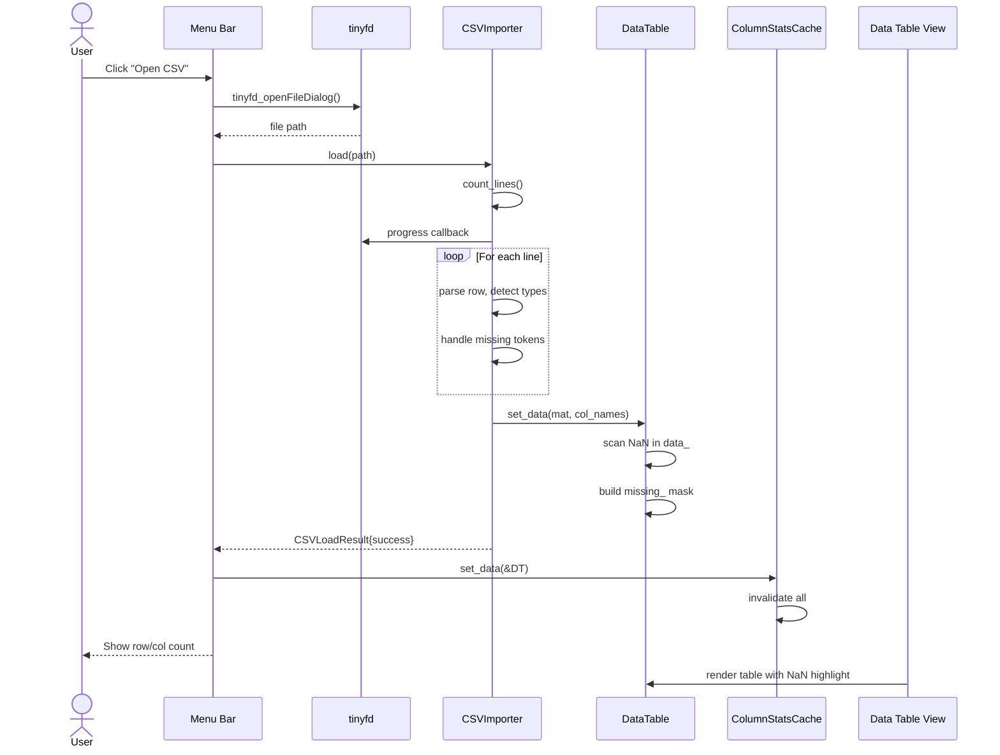
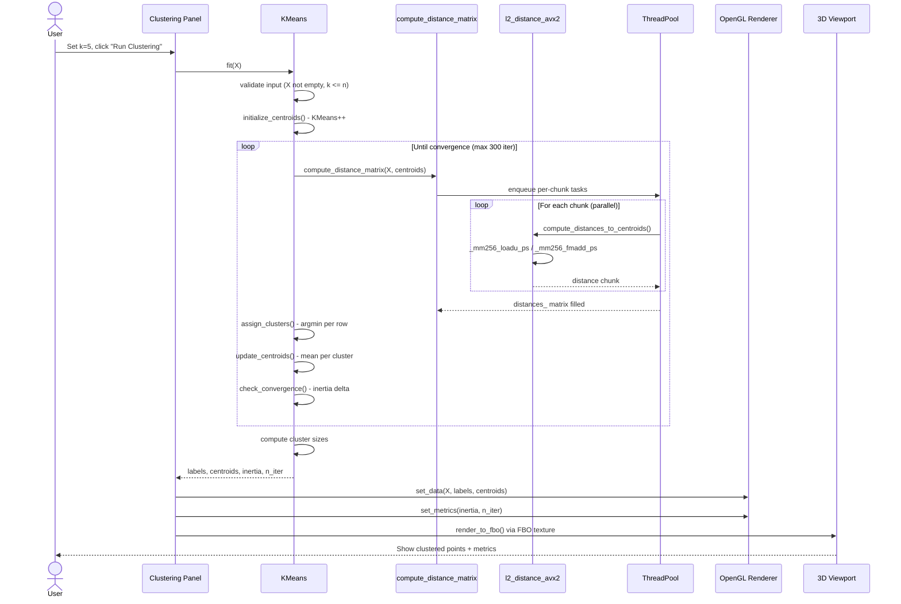
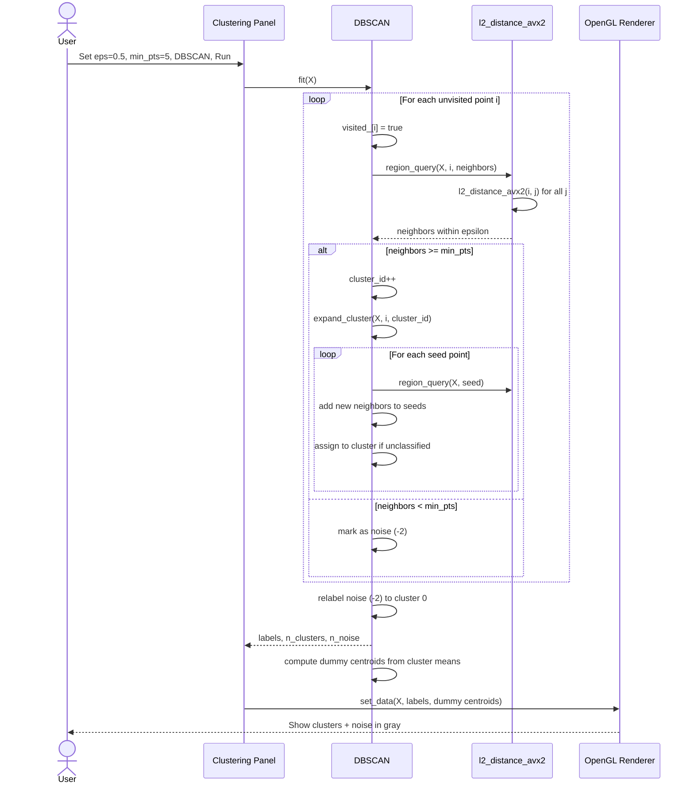
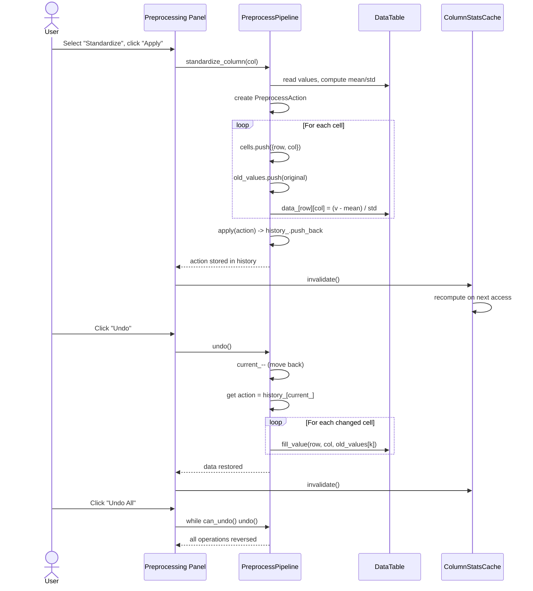
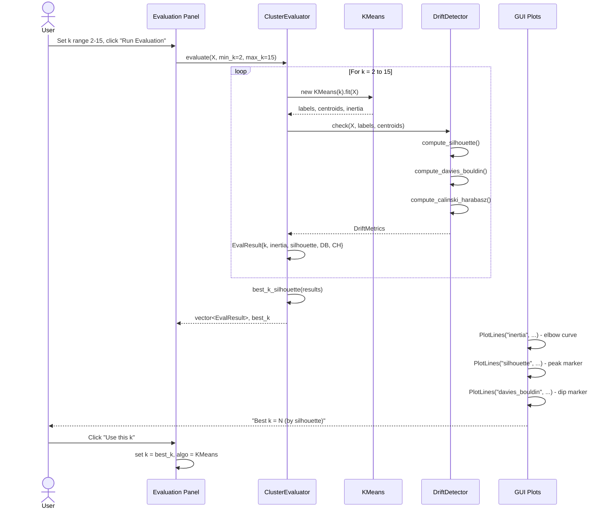
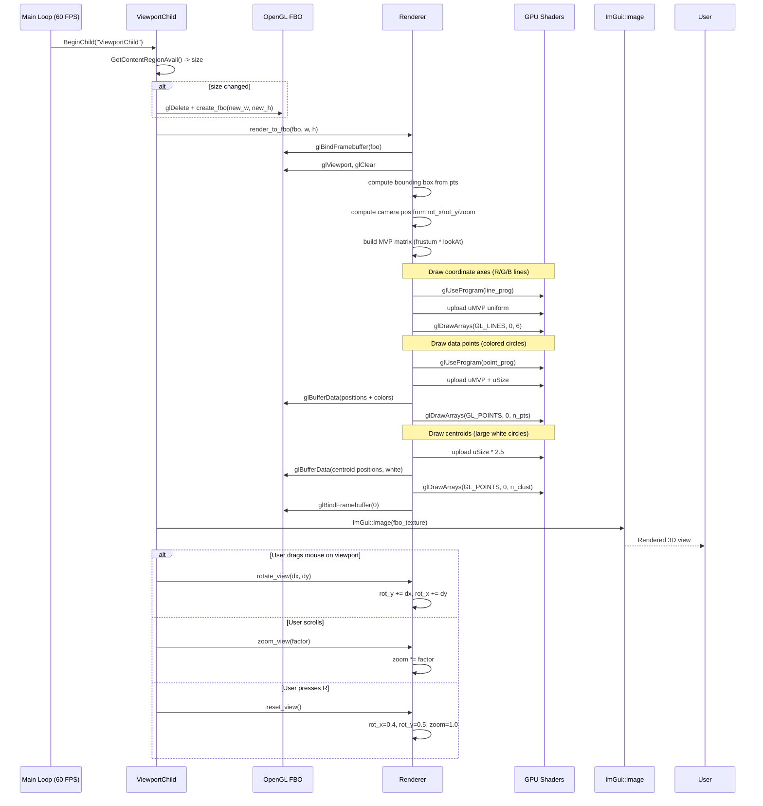

# Clustering Engine - Sequence Diagrams

## 1. CSV Import Flow

## 2. KMeans Clustering Flow

## 3. DBSCAN Flow

## 4. Preprocessing with Undo/Redo

## 5. Cluster Evaluation Flow

## 6. 3D Viewport Render Flow

